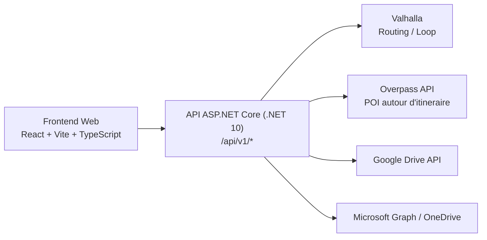

# BikeVoyager
Application full-stack de planification d'itineraires velo (API ASP.NET Core + frontend React) avec routage, POI, export GPX et synchronisation cloud.

[](https://github.com/arnaud-wissart-lab/BikeVoyager/actions/workflows/ci.yml)
[](https://github.com/arnaud-wissart-lab/BikeVoyager/actions/workflows/deploy-manual.yml)
[](LICENSE)

## Demo live
- Application: <https://bike.arnaudwissart.fr>
- Release: TODO (aucun tag/release Git detecte dans ce depot au 2026-03-03)
- Historique des changements: [CHANGELOG.md](CHANGELOG.md)

## Ce que ca demontre
- Conception full-stack coherente: frontend React/Vite + API .NET 10, avec contrat HTTP canonique `/api/v1/*`.
- API Minimal API versionnee et testee, avec endpoints de routage, boucle, POI, cloud sync, feedback et exports.
- Securite applicative concrete: CORS d'origines autorisees, origin guard, cookies HttpOnly, rate limiting par politique, headers de securite.
- Gestion d'un moteur externe lourd (Valhalla) avec readiness, endpoint de statut et mise a jour declenchable.
- Integrations externes cote backend uniquement: Valhalla, Overpass, Google Drive, OneDrive.
- Qualite logicielle automatisee par CI: restore/build/test, lint/format, E2E Playwright, audits vulnerabilites.
- Deploiement manuel reproductible via GitHub Actions (`workflow_dispatch`) sur runner `self-hosted` Linux avec Docker Compose.

## Captures


## Architecture


Schema detaille: [docs/ARCHITECTURE.md](docs/ARCHITECTURE.md)

## Stack technique
- Backend: ASP.NET Core `net10.0`, Minimal APIs, FluentValidation, Serilog, architecture `Domain / Application / Infrastructure`.
- Frontend: React `19.2.4`, TypeScript `5.9.x`, Vite `7.3.1`, Mantine `8.3.15`, Cesium `1.138.0`, i18next.
- Tests: xUnit (`BikeVoyager.UnitTests`, `BikeVoyager.ApiTests`), Vitest (`frontend`), Playwright E2E.
- AppHost local: .NET Aspire (`Aspire.AppHost.Sdk 13.1.1`, `Aspire.Hosting.Redis 13.1.1`).
- Conteneurs: Dockerfiles backend/frontend + stack Compose `front/api/valhalla/valhalla-bootstrap`.
- Moteur de routage: image Valhalla epinglee par digest SHA256 dans `deploy/home.compose.yml` et `infra/valhalla.compose.yml`.

## Demarrage rapide (dev local)
Prerequis:
- .NET SDK `10.0.x` (CI: `actions/setup-dotnet@v5`)
- Node.js `20` + npm (CI: `actions/setup-node@v6`)
- Docker + Docker Compose (necessaires pour Valhalla)
- PowerShell (`pwsh`) pour les scripts `scripts/dev-*`

Installation:
```bash
git clone https://github.com/arnaud-wissart-lab/BikeVoyager.git
cd BikeVoyager
dotnet restore BikeVoyager.sln
npm --prefix frontend ci
```

Lancement local (backend + frontend, et Valhalla si donnees disponibles):
```powershell
./scripts/dev-up
```

URLs utiles:
- Frontend: <http://localhost:5173>
- API: <http://localhost:5024>
- Health API: <http://localhost:5024/api/v1/health>
- Statut Valhalla: <http://localhost:5024/api/v1/valhalla/status>

Arret:
```powershell
./scripts/dev-down
```

Option AppHost (.NET Aspire):
```powershell
dotnet run --project backend/src/BikeVoyager.AppHost/BikeVoyager.AppHost.csproj
```

## Tests
Backend (unitaires + API):
```bash
dotnet test backend/tests/BikeVoyager.UnitTests/BikeVoyager.UnitTests.csproj
dotnet test backend/tests/BikeVoyager.ApiTests/BikeVoyager.ApiTests.csproj
```

Frontend (unitaires / integration):
```bash
npm --prefix frontend run test
```

E2E (Playwright):
```bash
npx --prefix frontend playwright install --with-deps chromium
npm --prefix frontend run e2e
```

Commandes agregees:
```powershell
./scripts/dev-test
./scripts/dev-audit
```

Pipeline CI reference: [`.github/workflows/ci.yml`](.github/workflows/ci.yml)

## Securite & configuration
Protections API appliquees:
- Versioning canonique: `/api/v1/*` ([docs/API.md](docs/API.md)).
- Session anonyme: cookie chiffre/signe via Data Protection (`HttpOnly`, `SameSite=Lax`, `Path=/api`, `Secure` si HTTPS).
- Cookies cloud OAuth cote API: `bv_cloud_pending_sid`, `bv_cloud_auth_sid` (HttpOnly, `Path=/api`).
- Origin guard sur les routes `/api/*` + enforcement des origines selon `ApiSecurity:AllowedOrigins`.
- Rate limiting global + politiques dediees `compute-heavy`, `export`, `feedback`.
- Hors `Development`: `HSTS`, redirection HTTPS, `X-Content-Type-Options`, `Referrer-Policy`, `X-Frame-Options`, `Permissions-Policy`.

Variables d'environnement courantes (placeholders):
```dotenv
# Cloud OAuth (API)
CloudSync__GoogleDrive__ClientId=__GOOGLE_CLIENT_ID__
CloudSync__GoogleDrive__ClientSecret=__GOOGLE_CLIENT_SECRET__
CloudSync__OneDrive__ClientId=__ONEDRIVE_CLIENT_ID__
CloudSync__OneDrive__ClientSecret=__ONEDRIVE_CLIENT_SECRET__

# Feedback (deploy/home.env)
FEEDBACK__ENABLED=true
FEEDBACK__SENDEREMAIL=contact@EXAMPLE.TLD
FEEDBACK__SENDERNAME=BikeVoyager
FEEDBACK__RECIPIENTEMAIL=contact@EXAMPLE.TLD
FEEDBACK__SUBJECTPREFIX=[BikeVoyager]
FEEDBACK__SMTP__HOST=smtp-relay.brevo.com
FEEDBACK__SMTP__PORT=587
FEEDBACK__SMTP__USESSL=true
FEEDBACK__SMTP__USERNAME=__BREVO_SMTP_LOGIN__
FEEDBACK__SMTP__PASSWORD=__BREVO_SMTP_KEY__

# Origines autorisees (exemple)
ApiSecurity__AllowedOrigins__0=https://bike.EXAMPLE.TLD
ApiSecurity__AllowedOrigins__1=http://localhost:5173
```

Guides detailles:
- [docs/RUNBOOK.md](docs/RUNBOOK.md)
- [SECURITY.md](SECURITY.md)
- [docs/API.md](docs/API.md)

## Licence
Projet sous licence MIT. Voir [LICENSE](LICENSE).
